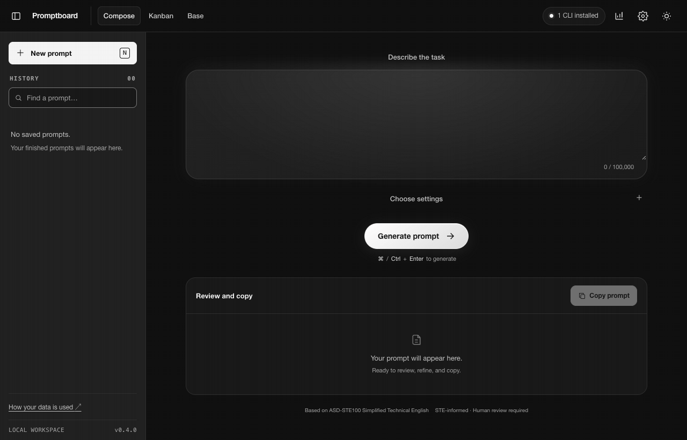
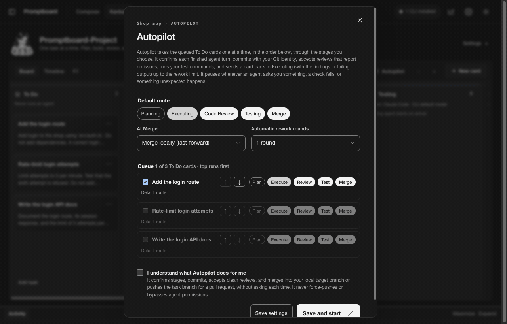
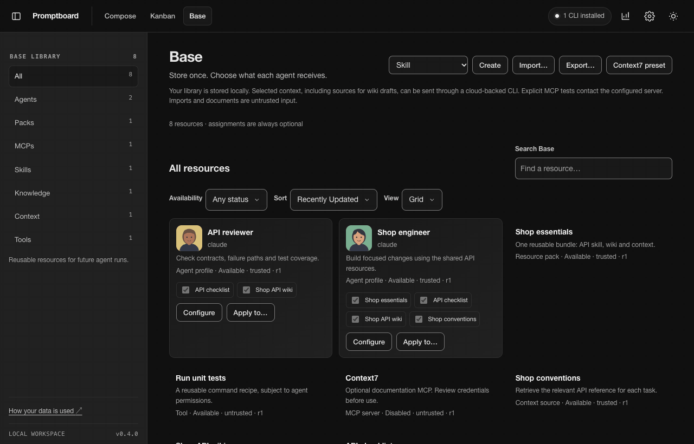

<p align="center">
  
</p>

<h1 align="center">Promptboard</h1>

<p align="center">
  <b>Compose prompts. Run coding tasks. Reuse agent resources.</b><br>
  A local-first workspace for your coding CLI and your repositories.
</p>

## Get started

Install **Node.js 22+**, **Git**, and a [supported coding CLI](#supported-clis). Sign in to that CLI, then run:

```bash
git clone https://github.com/datasound-projects/Promptboard.git
cd Promptboard
npm install
npm start
```

Open **http://127.0.0.1:4318**. The navigation is **Compose | Kanban | Base**. Press **Ctrl+C** to stop.

## Compose — turn an idea into a clear prompt

- Describe what you want to build or fix. Choose your CLI, model, language, and level of detail.
- Optional autonomous context research uses only relevant selected sources. Model calls wait for completion or **Cancel**, including reviewed generation and splitting; Compose does not cut off a healthy run on a timer.
- Review the generated prompt. Optionally edit and save your exact wording.
- Copy it, add it to Kanban, or split it into smaller, editable To Do tasks.

<p align="center">
  
  <br><sub>Idea → settings → prompt → optional edits → tasks</sub>
</p>

## Kanban — take tasks from To Do to Done

- Open an existing repository or create a project. Each task works in its own Git branch and worktree.
- Inspect each project's own folder tree in the Workspace sidebar. Open files with syntax colors and line numbers, edit and save explicitly, or review an optional AI file proposal before saving. Drafts survive refresh/minimization and disk conflicts cannot silently replace them. See [project files](docs/workspace-files.md).
- Drag a card to start its agent, or use **Autopilot** to run a queue one task at a time. Watch and interact through the built-in terminals.
- Plan, build, review, and test. Reviews and passing tests must match the current commit before a merge. Merge manually, or explicitly enable automatic merging.
- Choose providers and models per project or column. Customize columns, edit cards, and inspect run history.
- Pause stops a task's agent while keeping its conversation and files. Resume continues the captured native conversation in the same stage and workspace, without repeating the task prompt. Restart preserves session metadata without launching agents. Older Codex histories use [bounded exact-thread discovery](docs/codex-history-discovery.md). See [session persistence](docs/session-persistence.md) for limits.
- Kanban agents inherit tools and MCPs configured in their CLI alongside selected Base resources. Native permissions and administrator policies still apply. Legacy Planning/Review retain their stage restrictions; pipeline permissions come from configuration. See [Base delivery](docs/base-delivery.md).
- [Stable task numbers](docs/task-numbers.md) persist project-local identities through edits, moves, archive, deletion and portable backups. Numbers are available in task/board metadata; card display follows separately.
- Pipeline [task authoring](docs/pipeline-task-authoring.md) accepts a title without a prompt body. Creation enters To Do without starting agents; supplied Composer and split-task text stays exact.
- [Board profiles](docs/pipeline-board-profiles.md) supply named per-column settings and exclusive task-wide agent choices on pipeline cards. Save without starting agents; pause active agents before changes. Composer and edited split tasks still enter To Do with exact prompts.
- [Repository board configuration](docs/pipeline-repository-configuration.md) can be read and explicitly reviewed in Column Manager before applying shared definitions and personal overrides. After application, the selected visible board detects file changes and offers a fresh review without replacing open drafts or saved settings. Reads and saves start no agents or actions; automatic export and application remain pending.
- Column Manager offers an opt-in [column pipeline](docs/pipeline-lifecycle.md): compatible moves keep the agent alive and send no stage instructions; Done pauses/archives, and To Do stops/resets its current session while retaining files. Existing boards keep their stage rules.
- Pipeline [activity observations](docs/pipeline-activity.md) show outstanding work separately from response completion, with agent-scoped permission waits, explicit provider coverage and native approval evidence.
- [Queued destinations](docs/pipeline-queue.md) apply the latest settings without losing FIFO position; manual columns park agents and retain their conversations.
- [Completed pipeline tasks](docs/pipeline-completed-tasks.md) can be filtered and sorted by title or archive date. Restore uses the destination's settings; the card view retains Copy, Duplicate and Delete actions.
- [Bulk restore](docs/pipeline-bulk-restore.md) processes selected archive rows in order with task/settings revision checks, individual outcomes and Stop remaining. Unknown responses are not retried automatically.
- [Live settings](docs/pipeline-live-settings.md) wait for native turn completion before resuming the exact conversation with new settings or Base resources.
- [Native approved plans](docs/pipeline-native-plan.md) route Claude/Gemini cards to their configured target while preserving live implementation. Codex currently requires an explicit move.
- Pipeline first input uses a [task envelope](docs/pipeline-prompts.md) preserving engineered prompt content, with selected Base resources and inherited CLI tools. Column automations and advanced session strategies are still being implemented.

<p align="center">
  
  <br><sub>Project setup → To Do → Execute → Review → Test → Merge → Done</sub>
</p>

## Base — store once, reuse where you need it

- Keep one library of **Agents, Packs, MCPs, Skills, Knowledge, Context, and Tools**. **All** shows everything. Search and filter without losing your view settings.
- Create reusable agent profiles with instructions and configured resources. Save an optional illustrated avatar. Packs group resources by reference.
- Assign resources to one or several projects, columns, or tasks. Inherit them, add to them, replace them, or opt out. Saving or assigning never starts an agent.
- Edit linked Markdown wikis, import text sources, and optionally generate reviewable wiki drafts. **Run details** shows the pinned resources and what was actually supplied.

<p align="center">
  
  <br><sub>Store → configure → assign optionally → inspect delivery</sub>
</p>

<sub>All demos use the real interface in dark mode with simulated model responses and agents. File saves, the local Git workflow and Base resource delivery are real. Edited for speed; each GIF is under 12 seconds.</sub>

## Supported CLIs

| CLI | Compose | Kanban |
| --- | --- | --- |
| [Claude Code](https://code.claude.com/docs/en/quickstart) | Yes | Yes |
| [OpenAI Codex CLI](https://developers.openai.com/codex/cli) | Yes | Yes |
| [Gemini CLI](https://geminicli.com/docs/get-started/installation/) | Yes | Yes; not live-verified |
| [Antigravity](https://antigravity.google/docs/getting-started?tab=cli) (`agy`) | Yes | No |

Compose and Kanban use your CLI's existing sign-in and billing. MCP delivery depends on the provider and stage. Native Base subagents currently support **Claude Code writing stages**. See [Base delivery and limits](docs/base-delivery.md).

Open the top-bar **CLIs installed** control to manage CLI connections, sign-in and installation guides from any page. Choosing an account there does not change Compose's CLI/model selection. Compose's **More settings** contains generation details and brief options.

<details>
<summary><b>Settings, usage, and privacy</b></summary>

- **Settings** works across all three pages: theme, start page, agent defaults, terminal preferences, project workflows, and GitHub connection through the GitHub CLI.
- **Usage**, beside Settings, refreshes every minute. It shows available model/token totals, tool counts, cost estimates, allowance, and lightweight charts from local CLI records. Missing metrics stay marked unavailable; estimates are not invoices.
- Promptboard runs on **127.0.0.1**, with no analytics or telemetry. Compose history stays in your browser; boards, Base resources, logs, and worktrees stay in the local data folder. New project repositories live under `~/Promptboard/projects`, so other local tools can open them directly. Projects opened from an existing local folder remain at their original path.
- Prompts and selected context may be sent to your provider through its CLI. Explicit MCP tests may start a trusted server or contact its endpoint.
- Optional AI avatars use **OpenAI Images**, require a server-side `OPENAI_API_KEY`, and have separate API billing. No image key is stored in Base. [Avatar setup](docs/base-delivery.md#agent-profiles-native-subagents-and-avatars).

Read [SECURITY.md](SECURITY.md) before working with sensitive repositories. [Kanban workflow rules](docs/agentic-kanban-contract.md) explain approvals, evidence checks, and merges.

</details>

## More

- [Kanban parity plan](docs/kanban-parity-plan.md): the Kangentic reference, implementation gaps, and acceptance checks.
- [Column automation runtime](docs/pipeline-runtime-automations.md): ordered scripts/webhooks, durable outcomes, scoped Stop and no-replay recovery.
- [Action editor and results](docs/pipeline-automation-editor.md): row switches, ordering/copying, task-scoped Stop and durable history; native messages and explicit retries remain pending.
- [Browser column notifications](docs/pipeline-notifications.md): explicit browser permission, scoped display acknowledgements, task clicks and no replay after loss.
- [Initial prompt ownership](docs/initial-prompt-ownership.md): cancel pending paste or delayed Enter after human input, enforce process ownership, contain unknown writes and retain exact Composer/Base input.
- [Private terminal input observations](docs/terminal-input-observation.md): bounded paste-mode/control and manual-input evidence for owned pipeline processes, without granting delivery.
- [Automation execution primitives](docs/pipeline-automation-actions.md): bounded script/webhook/notification adapters.
- [Durable automation journal](docs/pipeline-automation-journal.md): atomic intent, ordered phases and interruption recovery; scheduler integration remains pending.
- [Ordered automation groups](docs/pipeline-automation-coordinator.md): durable dispatch, exit budgets and owned cancellation; native message scheduling remains pending.
- [Native message receipts](docs/native-message-receipts.md): exact new conversation turns, queue acceptance and cancellation guards; terminal scheduling and durable receipt integration remain pending.
- [Native receipt ownership](docs/native-message-custody.md): private Supervisor checkpoints bound to live processes, native identities and terminal input; message dispatch remains pending.
- [Private deferred input](docs/native-message-input.md): one owned paste/Enter attempt, exact native confirmation after pending hooks settle, distinct deadline/cancellation outcomes and bounded callbacks without draft clearing or replay; column scheduling and enabled message rows remain pending.
- [Journal-backed deferred delivery](docs/native-message-dispatch.md): exact dispatch scope, per-run ordering and durable native confirmation before releasing input; board scheduling remains pending.
- [Native-message live check](docs/live-native-messages.md): opt-in disposable provider checks with separate startup, input and durable-receipt results, plus an offline harness test.
- [Asynchronous message journal](docs/pipeline-message-journal.md): scheduled dispatch and durable delivery stages survive completed placement; runtime scheduling and receipt display remain pending.
- [Changelog](CHANGELOG.md) · [CLI adapters](docs/cli-adapters.md) · [Verification](RELEASE-VERIFICATION.md)
- [Contributing](CONTRIBUTING.md): `npm run check` and `npm test`. No frontend framework or build step.
- `node bin/ste.mjs --help` for command-line usage; `node bin/ste.mjs --doctor` for CLI detection.
- `npm start -- --port 4320` to use another port.
- `node scripts/record-demo.mjs` regenerates all three demos with Chrome and ffmpeg, without paid model calls.
- `node scripts/create-social-preview.mjs` renders the minimal Compose, Kanban and Base GitHub preview at 1280×640.

## License

[MIT](LICENSE). [Third-party notices](THIRD_PARTY_NOTICES.md). Writing rules draw on ASD-STE100 Simplified Technical English; ASD and STEMG do not endorse this project.
