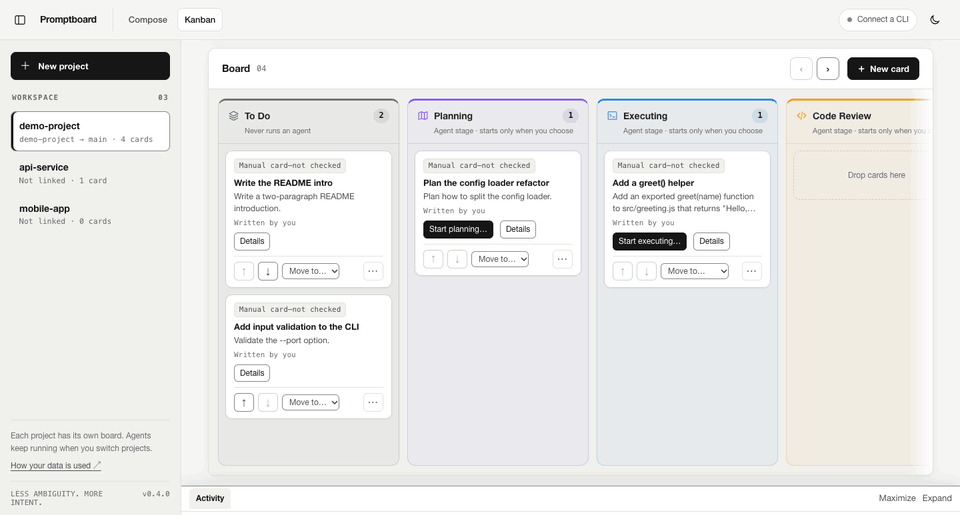

<p align="center">
  
</p>

<h1 align="center">Promptboard</h1>

<p align="center">
  Write clear prompts for AI coding agents, then run them on a local Kanban board.<br>
  Your own CLI · Your own repository · Nothing merges without you.
</p>

<p align="center">
  
  <br><sub>Demo recorded with a simulated agent CLI.</sub>
</p>

## What it does

Promptboard is a local web app with two pages.

- **Compose** turns a rough request into a structured prompt for a coding agent. It checks that code, quoted text, URLs, and paths stay unchanged, and flags missing or conflicting requirements. The writing rules draw on ASD-STE100 Simplified Technical English.
- **Kanban** runs each task through seven stages: To Do, Planning, Executing, Code Review, Testing, Merge, and Done. Agents work in a separate Git worktree for each task, in a terminal you can watch and type into.

Promptboard uses the CLIs you already have (**Claude Code, Codex CLI, Gemini CLI**, and **Antigravity** for prompts) with your existing sign-in. It has no API keys, no accounts, and no analytics.

## Requirements

- Node.js 22 or later, and Git.
- At least one supported CLI, installed and signed in:

| CLI | Compose | Kanban agent runs | Setup |
| --- | --- | --- | --- |
| Claude Code | Yes | Yes | [Install](https://code.claude.com/docs/en/quickstart) |
| OpenAI Codex CLI | Yes | Yes | [Install](https://developers.openai.com/codex/cli) |
| Gemini CLI | Yes | Yes, not verified live | [Install](https://geminicli.com/docs/get-started/installation/) |
| Google Antigravity (`agy`) | Yes | No | [Install](https://antigravity.google/docs/getting-started?tab=cli) |

Kanban agent runs are verified on macOS and Linux. They are not verified on Windows or WSL2. See [what was verified](RELEASE-VERIFICATION.md).

## Install and start

```bash
git clone https://github.com/datasound-projects/Promptboard.git
cd Promptboard
npm install
npm start
```

Open **http://127.0.0.1:4318** if the browser does not open. Use `npm start -- --port 4320` for another port. Press **Ctrl+C** once to stop: Promptboard stops its agents, removes temporary folders, and frees the port.

`npm install` adds the terminal packages (`node-pty` and `xterm`). On macOS and Windows, `node-pty` ships prebuilt binaries. On Linux it compiles during install and needs `python3`, `make`, and a C++ compiler. Without it, Compose still works and the board tells you what is missing.

## Compose a prompt

1. Describe the task in your own words. Put exact text in backticks or double quotes.
2. Choose the job, the CLI, the model and effort, the detail level, and the language (English, German, or Polish).
3. Click **Okay, let's goooo!** or press ⌘/Ctrl+Enter.
4. Read the prompt and the findings, then copy it or add it to the board.

**Reviewed** mode (default) drafts, checks, asks the model to review, and repairs once if needed (2–4 model calls). **Fast** mode drafts and checks (1 call). A passing report means the implemented checks found nothing. Always read the prompt yourself. This is a writing aid, not a certified STE checker. See [the method](docs/ste-method.md) and [verification](docs/verification.md).

## Run tasks on the board

1. **Pick or create a project** in the sidebar. Each project has its own board and repository; agents keep running when you switch.
2. **Link a repository.** Choose a local Git repository and a target branch. Promptboard does not create repositories, commit on your behalf without asking, or push.
3. **Add a card.** Write a task or add a prompt from Compose. The card keeps an exact copy.
4. **Move it through the stages.**

| Stage | What happens |
| --- | --- |
| To Do | Nothing runs. |
| Planning | Optional. The agent plans in read-only mode. You approve the plan. |
| Executing | The agent edits files in the task's own worktree and branch. You confirm when it is done. |
| Code Review | You commit the changes, then an agent reviews the diff read-only and lists findings. You accept them or send the task back. |
| Testing | Your test commands run in the worktree, without a shell. Only exit codes count. |
| Merge | You confirm a fast-forward merge into the target branch, or turn on **Merge automatically**: then a card merges on entry only if its accepted review and passing tests belong to exactly the current commits. Nothing is pushed. |
| Done | Reached only by a verified merge or an explicit "no changes required". |

Each project chooses what happens when a card enters a stage: **Manual**, **Ask** (default), or **Start automatically**. Starting an agent by hand always shows a consent dialog; automatic start is a setting you turn on per project and stage. Terminals open in the dock at the bottom of the page. You can collapse the dock, reload the page, or run several tasks at once (one by default, up to four). Promptboard never passes a bypass or "yolo" permission flag, never pre-trusts a folder for a CLI, and never force-resets or stashes your work.

The full behaviour is in the [Kanban contract](docs/agentic-kanban-contract.md).

## Privacy and data

- **Do not put API keys, tokens, passwords, or private code you cannot share with your AI provider into prompts or tasks.** Text you send goes to the provider through its CLI, and the CLI may keep its own logs.
- Promptboard runs only on `127.0.0.1` and sends nothing anywhere itself. It has no analytics and no telemetry.
- Prompt history stays in your browser. The board, run logs, and task worktrees are saved in `~/Library/Application Support/Promptboard` (macOS), `%APPDATA%\Promptboard` (Windows), or `~/.local/share/promptboard` (Linux). Set `PROMPTBOARD_DATA_DIR` to use another folder. Run one instance per data folder.
- Promptboard never reads or copies CLI credential files.

Read [SECURITY.md](SECURITY.md) before you use it with sensitive repositories.

## Terminal use

```bash
node bin/ste.mjs --provider codex < request.txt > prompt.md
node bin/ste.mjs --provider claude --language de --quality fast < request.txt
node bin/ste.mjs --provider agy --json < request.txt > result.json
```

Flagged drafts exit with code `2` and are withheld; use `--json` or `--allow-draft` to see them. Run `node bin/ste.mjs --help` for all options.

## Troubleshooting

| Problem | Action |
| --- | --- |
| Port already in use | `npm start -- --port 4320` |
| CLI not detected | `node bin/ste.mjs --doctor` |
| Agent seems stuck at the start | Open its terminal. The CLI may ask whether to trust the folder. Answer there. |
| Signed out or expired | Use **Connect / Sign in** under **More settings**, or run the shown command, then **Check again**. |
| Usage or rate limit | The error names the one your provider reported, with a reset time only when the provider gives one. |
| Board terminals unavailable | Run `npm install`. On Linux install `python3`, `make`, and a C++ compiler first. |

## Development

```bash
npm ci
npm run check
npm test
```

`scripts/live-flow.mjs` and `scripts/live-agents.mjs` run real CLIs in disposable repositories. They use your provider quota, so they never run in CI. See [CONTRIBUTING.md](CONTRIBUTING.md), [the changelog](CHANGELOG.md), and [live verification](docs/live-verification.md).

Released under the [MIT license](LICENSE). Third-party licences are in [THIRD_PARTY_NOTICES.md](THIRD_PARTY_NOTICES.md). ASD and STEMG do not endorse this project.
